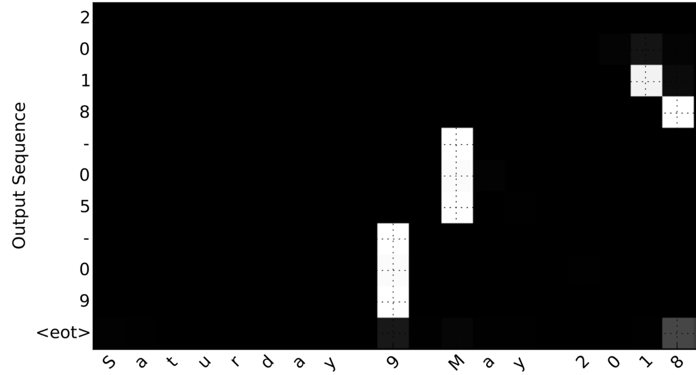

# Neural Machine Translation

You will build a Neural Machine Translation (NMT) model to translate human readable dates ("25th of June, 2009") into machine readable dates ("2009-06-25").You will do this using an attention model, one of the most sophisticated sequence to sequence models.

## Translating human readable dates into machine readable dates
The network will input a date written in a variety of possible formats (*e.g. "the 29th of August 1958", "03/30/1968", "24 JUNE 1987"*) and translate them into standardized, machine readable dates (*e.g. "1958-08-29", "1968-03-30", "1987-06-24"*). We will have the network learn to output dates in the common machine-readable format YYYY-MM-DD. 

<!-- 
Take a look at [nmt_utils.py](./nmt_utils.py) to see all the formatting. Count and figure out how the formats work, you will need this knowledge later. !--> 

## Neural machine translation with attention

The attention mechanism tells a Neural Machine Translation model where it should pay attention to at any step.

### Attention mechanism

In this part, you will implement the attention mechanism presented in the lecture videos. Here is a figure to remind you how the model works. The diagram on the left shows the attention model. The diagram on the right shows what one "Attention" step does to calculate the attention variables , which are used to compute the context variable  for each timestep in the output (). 

<table>
<td> 
  
</td> 
<td> 
  
</td> 
</table>
<caption>
 **Figure 1**: Neural machine translation with attention
</caption>

- There are two separate LSTMs in this model (see diagram on the left). Because the one at the bottom of the picture is a Bi-directional LSTM and comes *before* the attention mechanism, we will call it *pre-attention* Bi-LSTM. The LSTM at the top of the diagram comes *after* the attention mechanism, so we will call it the *post-attention* LSTM. The pre-attention Bi-LSTM goes through  time steps; the post-attention LSTM goes through  time steps. 

- The post-attention LSTM passes  from one time step to the next. In the lecture videos, we were using only a basic RNN for the post-activation sequence model, so the state captured by the RNN output activations . But since we are using an LSTM here, the LSTM has both the output activation  and the hidden cell state . However, unlike previous text generation examples (such as Dinosaurus in week 1), in this model the post-activation LSTM at time  does will not take the specific generated  as input; it only takes  and  as input. We have designed the model this way, because (unlike language generation where adjacent characters are highly correlated) there isn't as strong a dependency between the previous character and the next character in a YYYY-MM-DD date. 
- We use  to represent the concatenation of the activations of both the forward-direction and backward-directions of the pre-attention Bi-LSTM. 
- The diagram on the right uses a `RepeatVector` node to copy 's value  times, and then `Concatenation` to concatenate  and  to compute , which is then passed through a softmax to compute . We'll explain how to use `RepeatVector` and `Concatenation` in Keras below.

Implement two functions: `one_step_atetntion` and `model`

**1) `one_step_attention()`**: At step , given all the hidden states of the Bi-LSTM (},a^{<2>},&space;...,&space;a^{<T_x>}]">) and the previous hidden state of the second LSTM (}">), `one_step_attention()` will compute the attention weights (},\alpha^{<t,2>},&space;...,&space;\alpha^{<t,T_x>}]">) and output the context vector (see Figure  1 (right) for details):
}&space;=&space;\sum_{t'&space;=&space;0}^{T_x}&space;\alpha^{<t,t'>}a^{<t'>}\tag{1}">

Note that we are denoting the attention in this notebook . In the lecture videos, the context was denoted , but here we are calling it  to avoid confusion with the (post-attention) LSTM's internal memory cell variable, which is sometimes also denoted . 
  
**2) `model()`**: Implements the entire model. It first runs the input through a Bi-LSTM to get back },a^{<2>},&space;...,&space;a^{<T_x>}]">. Then, it calls `one_step_attention()`  times (`for` loop). At each iteration of this loop, it gives the computed context vector }"> to the second LSTM, and runs the output of the LSTM through a dense layer with softmax activation to generate a prediction }">.

**How you can implement layers with shareable weights in Keras:**

1. Define the layer objects(as global variables for examples).
2. Call these objects when propagating the input.

Use these layers  times in a for loop to generate the outpus, and their paramenters will not be reinitialized.

1. Propagate the input into a [Bidirectional](https://keras.io/layers/wrappers/#bidirectional) [LSTM](https://keras.io/layers/recurrent/#lstm)
2. Iterate for :
    1. Call `one_step_attention()` on },\alpha^{<t,2>},&space;...,&space;\alpha^{<t,T_x>}]$"> and }"> to get the context vector }">.
    2. Give }"> to the post-attention LSTM cell. Remember pass in the previous hidden-state  and cell-states  of this LSTM using `initial_state= [previous hidden state, previous cell state]`. Get back the new hidden state }"> and the new cell state }">.
    3. Apply a softmax layer to }">, get the output. 
    4. Save the output by adding it to the list of outputs.
3. Create your Keras model instance, it should have three inputs("inputs",}"> and }">) and output the list of "outputs".

As usual, after creating your model in Keras, you need to compile it and define what loss, optimizer and metrics your are want to use. Compile your model using `categorical_crossentropy` loss, a custom [Adam](https://keras.io/optimizers/#adam) [optimizer](https://keras.io/optimizers/#usage-of-optimizers) (`learning rate = 0.005`, , , `decay = 0.01`)  and `['accuracy']` metrics:

The last step is to define all your inputs and outputs to fit the model:
- You already have X of shape  containing the training examples.
- You need to create `s0` and `c0` to initialize your `post_activation_LSTM_cell` with 0s.
- Given the `model()` you coded, you need the "outputs" to be a list of 11 elements of shape (m, T_y). So that: `outputs[i][0], ..., outputs[i][Ty]` represent the true labels (characters) corresponding to the  training example (`X[i]`). More generally, `outputs[i][j]` is the true label of the  character in the  training example

## Visualizing Attention

Since the problem has a fixed output length of 10, it is also possible to carry out this task using 10 different softmax units to generate the 10 characters of the output. But one advantage of the attention model is that each part of the output (say the month) knows it needs to depend only on a small part of the input (the characters in the input giving the month). We can  visualize what part of the output is looking at what part of the input.

Consider the task of translating "Saturday 9 May 2018" to "2018-05-09". If we visualize the computed  we get this: 

  
<caption>
 **Figure ** Full Attention Map
</caption>

Notice how the output ignores the "Saturday" portion of the input. None of the output timesteps are paying much attention to that portion of the input. We see also that 9 has been translated as 09 and May has been correctly translated into 05, with the output paying attention to the parts of the input it needs to to make the translation. The year mostly requires it to pay attention to the input's "18" in order to generate "2018." 

The function `plot_attention_map`(see the file *nmt_utils.py*) pulls out the attention values from your model and plots them.

## Useful Functions
- Keras:
    - [RepeatVector()](https://keras.io/layers/core/#repeatvector): Repeats the input n times.
    - [Concatenate()](https://keras.io/layers/merge/#concatenate) 
    - [Dense()](https://keras.io/layers/core/#dense)
    - [Activation()](https://keras.io/layers/core/#activation)
    - [Dot()](https://keras.io/layers/merge/#dot)
    - [Bidirectional](https://keras.io/layers/wrappers/#bidirectional): Bidrectional Wrapper for RNNs. 
    - [LSTM](https://keras.io/layers/recurrent/#lstm): Long Short-Term Memory layer - Hochreiter 1997.

## Summary

- Machine translation models can be used to map from one sequence to another. They are useful not just for translating human language(like French->English) but also for tasks like date format translation.
- An attention mechanism allows a network to focus on the most relevant parts of the input when producing a specific part of the output.
- A network using an attention mechanism can translate from inputs of length   to outputs of length , where   and  can be different.
- You can visualize attention weights  to see what the network is paying attention to while generating each output.

